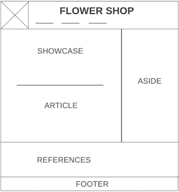

# Development Strategy

> `git workflow-for two`

A basic web page with semantic layout, developed collaboratively using branches.  It's not very interesting to look at.

## Wireframe

## 0. Set-Up

__A User can see my initial repository and live demo__

### Repository

1. Created a new repository [generated](https://github.blog/2019-06-06-generate-new-repositories-with-repository-templates/) from [this template](https://github.com/hackyourfuturebelgium/w3-validation-template)
1. Clone the repository
1. Copy-paste the markdown from this file to the empty `development-strategy.md` file in the new repo
1. Add [this wireframe](./wireframe.png) into your new repo
1. Start your README file
1. Push the changes
1. turn on GitHub Pages

---
---

## 1. title

__As a site visitor, I want to know what the web page is called__

> assigned to Olga Kozmovskaia

### Repository

1. This user story was developed locally by Olga Kozmovskaia on a brach called `title`.
2. The new branch was pushed to the shared repository
3. A pull request was made to `master` & reviewed by the team
4. Changes were merged to `master`

### HTML

- Add header with name of company and navigation in the right-side of header.
- Add logo company
- Add site navigation
- Add paragraph about copyright and the year of creation of the site in the footer

### CSS

- Use mono color for background of header and footer.
- Use contrast color of font.
- Use hover for navigation.

---
---

## 2.  introduction

__As a site visitor, I want to read an introduction to this web page__

> assigned to Kateryna Kim

### Repository

1. This user story was developed locally by Kateryna Kim on a brach called `introduction`.
2. The new branch was pushed to the shared repository
3. A pull request was made to `master` & reviewed by the team
4. Changes were merged to `master`

### HTML

- added section element, showcase and container

### CSS

- edited text, added background color and positioning
## 3. main text

__As a site visitor, I want to learn about company and services__

> assigned to Olga Kozmovskaia

### Repository

1. This user story was developed locally by Olga Kozmovskaia on a brach called `main-text`.
2. The new branch was pushed to the shared repository
3. A pull request was made to `master` & reviewed by the team
4. Changes were merged to `master`

### HTML

- Add article element About Us
- Add aside element What we do

### CSS

- Use mono color for background elements.
- Use contrast color of font.

---
---

## 4. references

__As a site visitor, I want to know where I can learn more__

> assigned to Kateryna Kim

### Repository

1. This user story was developed locally by Kateryna Kim on a brach called `references`.
2. The new branch was pushed to the shared repository
3. A pull request was made to `master` & reviewed by the team
4. Changes were merged to `master`

### HTML

- added aside element
- added relevant links 

### CSS

Styling for the new element

- added background, adjusted the positioning

## 5. Finishing Touches

__As a perfectionist, I want everything perfect :)__

- Write final, complete README
- Check for styling errors with a linter & prettify code
- Validate source code on w3 to check for any last mistakes
